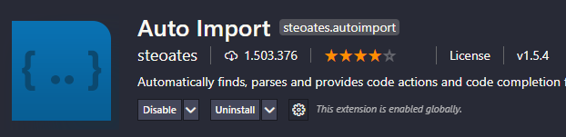
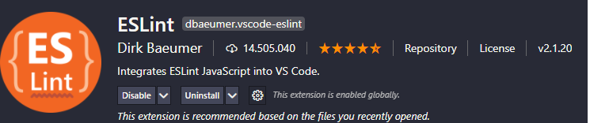
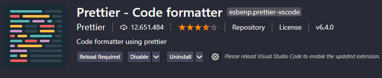
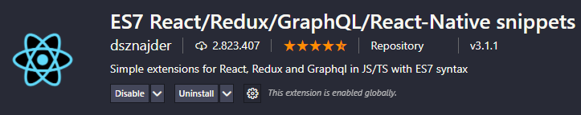
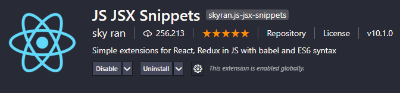
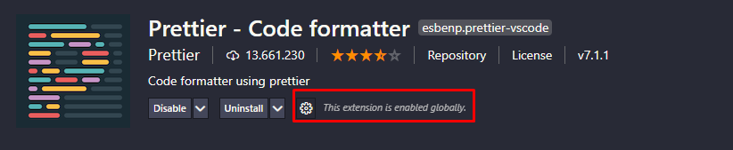
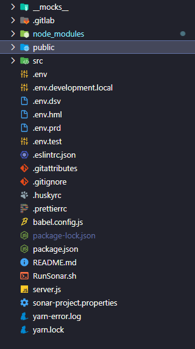

## React Web Application Boilerplate

O principal objetivo deste projeto é manter um boilerplate atualizado para a criação de **React Web Apps** e **Progressive Web Apps**.

## :rocket: Inicializando o ambiente

Passo-a-passo para inicializar o ambiente

### Clone o repositório

```bash
$ git clone http://git.tribanco.com.br/tricard/site-lojista-pwa-web
```

### Instalando as dependências

```bash
$ npm i
```

### Iniciar o servidor

```bash
$ npm run start
```

## :heavy_check_mark: Padrões

Definições para manter a padronização da arquitetura

- NPM ou Yarn;
- Biblioteca UI [MaterialUI](https://material-ui.com);
- Para estilização mais complexa de componentes [Styled Components](https://styled-components.com);
- Framework de internacionalização [react.i18next](https://react.i18next.com);
- Linter: Reportar padrões de ECMAScript/JavaScript [ESLint](https://eslint.org);
- Mocks: [Mirage](https://miragejs.com/docs/getting-started/introduction/);
- [Por que react-scripts?](https://create-react-app.dev/docs/getting-started/);
- [Por que Axios?](https://github.com/axios/axios#features);
- [Por que MaterialUI?](https://material-ui.com/blog/material-ui-v4-is-out)

Nesse projeto foi adotado o padrão de componentes funcionais utilizando Hooks

[API de Referência dos Hooks](https://pt-br.reactjs.org/docs/hooks-reference.html)
[Exemplos de como utilizar/criar Hooks](https://pt-br.reactjs.org/docs/hooks-custom.html)

## :open_file_folder: Project structure

- **src/assets**: Arquivos estáticos (imagens, fontes and icones);
- **src/resources**: Configurações de API e endpoints;
- **src/mock**: Configurações de mocks de APIs;
- **src/components**: Componentes react para serem reutilizados e compartilhados;
- **src/common**: Utils, constantes, configurações, i18n e outros;
- **src/containers**: Componentes que se comportam como paginas;
- **src/routes**: Rotas do aplicativo para serem usadas na navegação da SPA;
- **src/store**: Configuração de estados do Redux;
- **docs**: Documentos de congiguração.


# Projeto React Site Lojista PWA
> Este projeto deve ser utilizado de refer�ncia para o desenvolvimento das aplica��es React Hooks usando Material-UI Framework em aplica��es auto contidas.

## Aten��o
#### Qualquer melhoria, corre��o ou adi��o de exemplos pode ser desenvolvida e solicitado um Merge Request para aprova��o.

## Sum�rio

* [Criacao de um novo projeto](README.md#criacao-de-um-novo-projeto)
    * [Configuracao de ambiente](README.md#configuracao-de-ambiente)
        * [NodeJS](README.md#nodejs)
        * [Yarn](README.md#yarn)
        * [Instalacao extensoes vscode](README.md#Instalacao-extensoes-vscode)
* [Padroniza��o do C�digo](README.md#padronizacao-do-codigo)
* [Formatador do C�digo](README.md#formatador-do-codigo)
* [Estrutura do projeto](README.md#estrutura-de-pacotes-do-projeto)
* [Componentes Compartilhados](README.md#componentes-compartilhados)
* [Nomeando Componentes](README.md#nomeando-componentes)
* [Hooks](README.md#hooks)
* [Material UI](README.md#material-ui)
* [Testes](README.md#testes)
* [Code Review](README.md#code-review)
    
## Criacao de um novo projeto
### Configuracao de ambiente
Utilizaremos neste documento o [Visual Studio Code](https://code.visualstudio.com/download) como IDE de desenvolvimento da aplica��o.

### NodeJS
Primeiramente devemos fazer a instala��o do [NodeJS](https://nodejs.org/en/) - ambiente de execu��o JavaScript server-side. Confira o sucesso da instala��o com o comando **node -v**.

### Yarn
Baixe o [YARN](https://yarnpkg.com/pt-BR/) da �ltima vers�o est�vel. Confira o sucesso da instala��o com o comando **yarn -v**.

### Visual Studio Code - Configura��es necess�rias
- Configure o espa�amento para 2 espa�os -> **Caminho**: Arquivo >>> Prefer�ncias >>> Configura��es >>> Configura��es de Pesquisa: **editor.tabSize** >>> **2**
- Mude a sequ�ncia de final de linha padr�o para **LF**. **Caminho**: Arquivo >>> Prefer�ncias >>> Configura��es >>> Configura��es de Pesquisa: **files.eol** >>> **\n**
- Quando abrir um arquivo antigo, mude a quebra de linha para **LF** clicando na barra inferior sobre o c�digo **CRLF**.

### Instalacao extensoes vscode:

- **Auto Import** - imports autom�ticos



- **ESLint** - padroniza��o de c�digo



- **Prettier** - formata��o de c�digo



- **ES7 React/Redux/GraphQL/React-Native snippets** - snippets



- **JS JSX Snippets** - snippets



### Ap�s instala��o das extens�es - Abra a pasta do reposit�rio no Visual Studio Code e execute os seguintes comandos no terminal: 

- **yarn**
- **yarn start**

### Importar e inserir esse c�digo na frente do <Switch> para incluir o login no React:
- import LoginContainer from './features/login';
- < Route exact path={`${process.env.PUBLIC_URL}/`} component={LoginContainer} />

## Padronizac�o de c�digo

� interessante que o c�digo das aplica��es siga o mesmo padr�o de formata��o para evitar discuss�es sobre estilo de codifica��o durante o desenvolvimento / revis�o de c�digo, e para tamb�m evidenciar mudan�as em diffs. � importante tamb�m que esse padr�o possu uma "[opini�o](https://www.thoughtworks.com/radar/techniques/opinionated-and-automated-code-formatting)", justamente para garantir que h� apenas uma maneira correta.

### Formatador de C�digo

Em nosso cen�rio atual, nosso formatador de c�digo e o **Prettier**. Confira em seu VSCODE se a extens�o est� ativa. **Caminho**: Extens�es >>> Prettier - Code Formatter >>> Enabled



### Considera��es importantes

Esse projeto utiliza uma ferramenta chamada "husky", que serve para formatar o c�digo antes de realizar um commit. � importante n�o utilizar a flag de bypass para garantir que todo c�digo que chega no reposit�rio remoto esteja padronizado.

## Estrutura do projeto

* **Diret�rios do Projeto**: Estrutura do projeto ap�s ter feito todos os passos de configura�ao.
    * **public**: Possui os arquivos p�blicos do projeto.
    * **src**: Possui todo o c�digo privado do projeto. Inluindo o arquivo "index.js", que � a raiz para carregar todos os componentes do projeto.
    * **package.json**: Possui todas informa��es do projeto, inclusive quais s�o as depend�ncias que o projeto necessita. **Observa��o**: N�o altere as vers�es dos modulos desse arquivo, pois pode gerar diversos problemas na compila��o final do projeto. Em caso de necessidade de atualiza��o ou inclus�o de modulo nesse arquivo, entrar em contato com o lider de equipe.
    
## Estrutura do Projeto - Pasta de Recursos

Pasta por tipo funciona apenas em projetos de pequena escalas. Pastas por Recursos � superior na maioria dos casos, � melhor pela escalabilidade, destaca-se pela alta modularidade e coes�o. Isso nos permite reproduzir o escopo dos componentes.

```text

.
|--- public
|--- |--- img/
|--- |--- |--- pix/
|--- |--- |------ icone_alerta.svg
|--- |--- index.html
|--- src
|--- |--- features/
|--- |--- |--------pix/
|--- |--- |------------agendamento/
|--- |--- |------------------------redux/
|--- |--- |------------------------------agendamentoOperations.js
|--- |--- |------------------------------agendamentoActions.js
|--- |--- |------------------------------agendamentoReducer.js
|--- |--- |------------------------------index.js
|--- |--- |------------------------views/
|--- |--- |-----------------------------components/
|--- |--- |---------------------------------------filtro-tipo-agendamento/
|--- |--- |--------------------------------------------------------------FiltroAgendamento.jsx
|--- |--- |--------------------------------------------------------------filtroAgendamento.scss
|--- |--- |------------------------AgendamentoContainer.jsx
|--- |--- |------------------------agendamentoContainer.scss
|--- |--- |------------------------constants.js
|--- |--- |------------------------NomeCampos.js
|--- |--- |------------------------AgendamentoService.js
|--- |--- |-------breadCrumbs.js
|--- |--- |-------LoginEfetuado.jsx
|--- |--- redux/
|--- |--- |--- Arquivos.js
|--- |--- shared/
|--- |--- |---- autenticacao/
|--- |--- |------------------ArquivosAutenticacao....
|--- |--- |---- components/
|--- |--- |---------------breadcrumbs/
|--- |--- |--------------------------BreadCrumbs.jsx
|--- |--- |--------------------------breadcrumbs.scss
|--- |--- |---- store/
|--- |--- |----------index.js
|--- |--- |----------reducer.js
|--- |--- |-----App.css
|--- |--- |-----App.jsx
|--- |--- |-----index.js
|--- |--- |-----setupTests.js
|----.env
|----.env.development.local
|----.env.dsv
|----.env.prd
|----.env.test
|----.eslintrc.json
|----.gitattributes
|----.gitignore
|----.huskyrc
|----.prettierrc
|-----babel.config.js
|-----package.json
|-----README.md
|-----RunSonar.sh
|-----server.js
|-----sonar-project-properties
|-----yarn-error.log
|-----yarn.lock
.
```

## Components Compartilhados
- Al�m da separa��o dos m�dulos, temos a pasta **components** dentro de nosso **src/shared**, e dentro dela inclu�mos todos os componentes gen�ricos da aplica��o.
- Esse caminho s�o nossos componentes gen�ricos o suficiente para n�o pertencer a nenhum m�dulo. S�o componentes que n�o possuem nenhuma regra de neg�cio da aplica��o, ou uma regra de aplica��o que replica para todas as telas da aplica��o. Exemplos de componentes assim s�o: Buttons,Cards,Codigo-Pin,AutoComplete, Token etc.

## Criacao de Componentes
- Ao criar os arquivos **jsx** e **scss** do componente, n�o coloque os dois nomes dos arquivos iguals por exemplo: **InputFormatNumber.jsx** e **InputFormatNumber.scss**, o react ao compilar o caminho de importa��o � *sens�vel* a casos (para alguns ambientes). Pode ocorrer de n�o encontrar o componente na compila��o.
- Forma correta de cria��o de arquivos do componentes s�o exemplo: **InputFormatNumber.jsx** e **inputFormatNumber.scss**.(Utilizando letra minuscula no tipo de arquivo **scss**,**css** caso o nome for permanecer o mesmo)

## Nomeando Componentes

- Acima j� vimos que nossa estrutura de nossas pastas e separamos nossos componentes por m�dulos, por�m sempre vem h� quest�o de como nomear um novo componente.
- Quando falamos em nomear o componente, se trata apenas do nome que damos a **const** que define o componente:

Exemplo: const **MyComponent** () => {};

Os nomes deve ser claro e �nico dentro do sistema, a fim de facilitar sua localiza��o e evitar possiveis confus�es. O nome do componente � muito �til quando precisamos inspecion�-lo utilizando ferramentos como o React Dev Tools, e tamb�m � muito �til quando ocorre algum tipo de erro na aplica��o, o erro sempre vem com o nome do componente onde ele ocorreu.
Para nomear os componentes, vamos seguir o padr�o **path-based-component-maning**, que consiste em voc� nomear o componente de acordo com a sua localiza��o em rela��o a pasta componentes, Basicamente, um componente que se encontra no path: **shared/components/button/ButtonTribanco.jsx**, ser� nomeado como **ButtonTribanco** e n�o como **ButtonTribancoButton**.

### Esse padr�o possui varios ben�ficios como:
- Facilita a busca do arquivo dentro do projeto
- Facilita a localiza��o na navega��o em arvore das pastas.
- Evita repeti��o de nomes na Importa��o - seguindo esse padr�o, sempre ira nomear o arquivo de acordo com o contexto que ele se encontra. No caso do nosso *Button*, ele � um *button tribanco* podendo ser aproveitado em diversas telas e o arquivo em si chamara **ButtonTribanco.jsx.**

## Neste Projeto n�o utilizamos classes e sim HOOKS

### Motivo, Estado e Ciclos de vida
- Redu��o de escrita e a facilidade de se compreender melhor como o componente ira se comportar.
- *useState*: � a forma como definimos nosso estado em nossos componentes.
- *useReducer*: � uma alternativa para mantermos nosso estado quando o mesmo � mais complexo. Se j� conhece a sintaxe do redux, a mesma � utilizada no useReducer. Algo que deve ser mencionado � que aqui n�o temos a propaga��o do estado por toda a aplica��o como o redux proporciona. Caso queira algo similiar, ter� que utilizar useContext.
- *useEffect*: � o respons�vel por lidar com side effects em nossa aplica��o, ele ir� substituir os ciclos de vida que tinhamos anteriormente. O primeiro par�metro do useEffect � uma fun��o de callback que ir� ser disparada quando o componente for montado.


### Regras
Algumas regras devem ser cumpridas na utiliza��o de hooks:
- N�o utilize hooks em loops.
- N�o utilize hooks em condi��es.
- declase seus hooks no topo do componente.

Para manter este padr�o e evitar problemas, existe um plugin do eslint que pode auxiliar e evitar o uso incorreto dos hooks:
-eslint-plugin-react-hooks

## Material-UI

Neste projeto utilizamos a biblioteca de componentes React - Material-UI para um desenvolvimento �gil e f�cil.

### Considera��es importantes

Aten��o ao utilizar um novo componente da biblioteca e na atualiza��o de algum componente j� em uso para n�o impactar as demais telas. Consultar equipe t�cnica do projeto antes de tal a��o.


## Testes
Utilizamos Jest que � um poderoso Framework de Testes em Javascript com foco na simplicidade.
* **Beneficios**:
    * **R�pido � Seguro**: Ao garantir que seus testes tem um estado global �nico, Jest pode executar testes em paralelo de forma conf�avel. Para tornar as coisas r�pidas, Jest executa testes anteriores falharam primeiro e organiza novamente com base no quanto os arquivos de teste demoram.
    * **Cobertura de C�digo**: Jest coleta informa��es de cobertura de c�digo de projetos inteiros, incluindo arquivos n�o testados.
    * **Simula��es F�ceis**: Jest usa um resolvedor customizado para importa��es em seus testes, tornando simples simular qualquer objeto fora do escopo de seus teste.
    * **Exce��es Claras**: Testes falham, quando eles ocorrem o Jest fornece um contexto rico do porque falhou.

### Considera��es importantes

Esse projeto utiliza o jest, como foi bem definido acima. Antes de realizar um commit e necess�rio executar o comando **npm run test** e verificar o coverage.

## Code Review e Merge Request

Adotamos a pr�tica do Code Review, pois quando outro desenvolvedor faz a revis�o desse trabalho, ocorre uma distribui�o saud�vel do conhecimento. Ao entenderem o processo de **desenvolvimento do c�digo** e como foram feitas as implementa��es de cada feature, todos os membros da equipe respons�veis pela revis�o passam a ter a capacidade de trabalhar naquela feature. Um dos benef�cios que detalha a import�ncia do code review �, sem d�vida, o ganho de produtividade.
Na verdade, ela pode at� dobrar j� que, ao remover todo o peso de uma s� pessoa e compartilhar o conhecimento, o trabalho em conjunto faz com que tudo se torna mais �gil - desde poss�veis solu��es para determinados problemas at� a pr�pria tomada de decis�o.
Em outras palavras, um ambiente de desenvolvimento mais coletivo faz com que as responsabilidades sejam divididas e nenhum desenvolvedor fique sobrecarregado, o que aumenta a produtividade geral dos projetos.
* **Boas Pr�ticas**:
    * **Criar** alguns checklists para serem usados de guia na revis�o do c�digo. Em certos casos, podem ser listas com a verifica��o da autentica��o, da encripta��o dos dados, de vulnerabilidades anteriores e etc.
    * **O Code Review** deve ser executado sempre que houver alguma mudan�a no c�digo, mesmo que esta seja pequena. Especialmente nos casos de ciclos iterativos, em que mudan�as menos podem ocasionar grandes impactos em s�ries, gerando vunerabilidade imprevistas pela equipe.

### Considera��es importantes

Aproveitando o gatilho do Code Review, o aprovador pode tamb�m realizar a aprova��o do Merge Request.